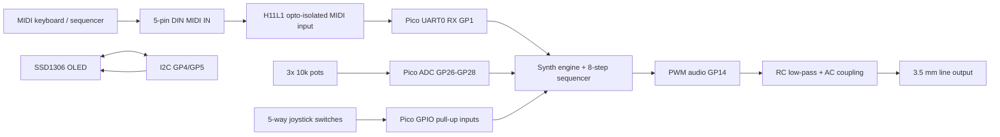

# Pico MIDI Synth Module

Starter project for a small MIDI-controlled synth module built around a Raspberry Pi Pico or Pico H using the Arduino-Pico core.

This version is intentionally simple enough to build on stripboard/perfboard:

- DIN MIDI input through an opto-isolator
- 128x64 I2C SSD1306 OLED
- 5-way digital joystick with push button
- three potentiometers on the Pico ADC inputs
- mono PWM audio line output on a 3.5 mm jack
- four-voice synth engine with sine, saw, square, triangle, and noise oscillators
- two-oscillator detune/thickening control
- low-pass tone control
- simple 8-step sequencer seeded by MIDI notes

Important limitation: the Pico/RP2040 has no real DAC. The included audio output uses PWM plus an external low-pass filter. This is good enough for a first module and line-level experiments, but an I2S DAC module such as PCM5102A is the recommended upgrade for a quieter final instrument.

## Project Files

- [firmware/pico_midi_synth/pico_midi_synth.ino](firmware/pico_midi_synth/pico_midi_synth.ino) - Arduino sketch
- [docs/wiring.md](docs/wiring.md) - pin map, schematics, module wiring
- [docs/bom.md](docs/bom.md) - parts list and substitutions
- [docs/aliexpress-order-list.md](docs/aliexpress-order-list.md) - one-shot AliExpress shopping list with upgrade parts
- [docs/build-guide.md](docs/build-guide.md) - soldering and bring-up sequence
- [docs/controls.md](docs/controls.md) - UI, pots, MIDI behavior, sequencer

## Hardware Assumptions

- Board: Raspberry Pi Pico, Pico H, Pico W, or Pico WH. The sketch targets RP2040 boards through the Earle Philhower Arduino-Pico core.
- MIDI connector: 5-pin DIN female panel connector wired as MIDI IN through a 3.3 V compatible opto-isolator.
- Display: 128x64 SSD1306 I2C OLED at address `0x3C`.
- Joystick: 5-way switch module, common pin to ground, directions to GPIO inputs with internal pull-ups.
- Pots: 10k linear potentiometers, one side to 3V3, one side to GND, wiper to ADC.
- Audio: mono line output. Do not drive passive headphones directly from the Pico pin.

## Quick Build Order

1. Install the Arduino-Pico board package.
2. Install Arduino libraries: `MIDI Library`, `Adafruit SSD1306`, and `Adafruit GFX Library`.
3. Wire and test the OLED first.
4. Wire the three pots and verify values on the OLED.
5. Build the PWM audio filter and verify the startup tone/noise floor.
6. Add MIDI IN and test note on/off from a keyboard or USB-MIDI interface.
7. Add the joystick and test sequencer editing.

## High-Level Diagram

## References

- Raspberry Pi Pico boards expose 26 multifunction GPIO pins, two I2C, two UART, three 12-bit ADC inputs, and PWM outputs: [Raspberry Pi Pico documentation](https://www.raspberrypi.com/documentation/microcontrollers/pico-series.html).
- Arduino-Pico documents that RP2040 has no onboard DAC and uses PWM for analog-style output: [Arduino-Pico Analog I/O](https://arduino-pico.readthedocs.io/en/latest/analog.html).
- Arduino-Pico includes `PWMAudio` for RP2040 PWM audio output: [Arduino-Pico PWM Audio](https://arduino-pico.readthedocs.io/en/latest/pwm.html).
- Arduino-Pico hardware UARTs are `Serial1`/`UART0` and `Serial2`/`UART1`, with assignable pins before `begin()`: [Arduino-Pico Serial](https://arduino-pico.readthedocs.io/en/latest/serial.html).
- The OLED sketch uses Adafruit's SSD1306 library, which depends on Adafruit GFX: [Adafruit SSD1306 docs](https://adafruit.github.io/Adafruit_SSD1306/html/index.html).
- The MIDI parser uses FortySevenEffects' Arduino MIDI Library: [Arduino MIDI Library](https://github.com/FortySevenEffects/arduino_midi_library).
- H11L1-style opto-isolators are a practical 3.3 V MIDI input choice because common parts specify a 3 V to 15/16 V supply range and 1 MHz class data rate: [DigiKey H11L1 listing](https://www.digikey.com/en/products/detail/everlight-electronics-co-ltd/H11L1/2691156).
