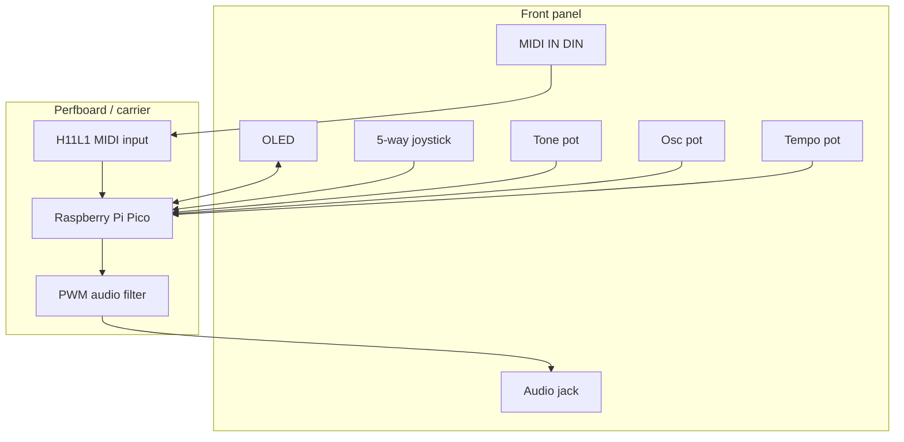

# Wiring

This wiring keeps every required function on a Pico without adding an external ADC. The joystick is a 5-way digital switch, not an analog X/Y joystick.

## Pin Map

| Function | Pico GPIO | Physical pin | Notes |
| --- | ---: | ---: | --- |
| MIDI IN RX | GP1 / UART0 RX | 2 | From opto-isolator output |
| MIDI OUT placeholder | GP0 / UART0 TX | 1 | Not required by this first sketch |
| OLED SDA | GP4 / I2C0 SDA | 6 | 3.3 V I2C OLED |
| OLED SCL | GP5 / I2C0 SCL | 7 | 3.3 V I2C OLED |
| Joystick up | GP6 | 9 | Switch to GND, internal pull-up |
| Joystick down | GP7 | 10 | Switch to GND, internal pull-up |
| Joystick left | GP8 | 11 | Switch to GND, internal pull-up |
| Joystick right | GP9 | 12 | Switch to GND, internal pull-up |
| Joystick click | GP10 | 14 | Switch to GND, internal pull-up |
| Audio PWM | GP14 | 19 | Through RC filter and AC coupling |
| Pot 1 tone | GP26 / A0 | 31 | 10k pot wiper |
| Pot 2 osc mix | GP27 / A1 | 32 | 10k pot wiper |
| Pot 3 tempo | GP28 / A2 | 34 | 10k pot wiper |
| 3.3 V rail | 3V3(OUT) | 36 | OLED, pots, opto output pull-up |
| Ground | GND / AGND | many | Use AGND pin 33 for pot ground if convenient |

Do not feed 5 V into Pico GPIO. All GPIO and ADC pins are 3.3 V logic.

## Power

For the first build, power the Pico from USB. The Pico's `3V3(OUT)` pin can power the OLED, pots, and the output side of the opto-isolator. Keep audio ground and pot ground wiring short and return them to a common ground point near the Pico.

## Potentiometers

Use 10k linear pots.

```text
Pico 3V3(OUT) ---- pot outer lug
Pico GND --------- pot other outer lug
Pico ADC --------- pot center wiper
```

Add an optional 100 nF capacitor from each ADC wiper to ground if the displayed values jump around.

## OLED

Most small SSD1306 I2C modules have four pins:

```text
OLED VCC -> Pico 3V3(OUT)
OLED GND -> Pico GND
OLED SDA -> Pico GP4
OLED SCL -> Pico GP5
```

Use a 3.3 V compatible module. Many OLED boards include pull-up resistors already. If yours does not, add 4.7k pull-ups from SDA and SCL to 3V3.

## Joystick

Use a 5-way navigation switch with one common terminal and five switch outputs.

```text
Joystick common -> Pico GND
UP              -> GP6
DOWN            -> GP7
LEFT            -> GP8
RIGHT           -> GP9
CLICK           -> GP10
```

The sketch enables `INPUT_PULLUP`, so an unpressed switch reads high and a pressed switch reads low.

If you want an analog X/Y joystick instead, the Pico does not have enough exposed ADC inputs for X, Y, and three pots at the same time. Use an external I2C ADC such as ADS1115, or reduce the number of pots.

## MIDI IN Circuit

Use a proper opto-isolated MIDI input. Do not connect a DIN MIDI jack directly to a Pico GPIO.

Preferred parts:

- 5-pin DIN female panel connector
- H11L1 opto-isolator
- 220 ohm resistor
- 1k resistor
- 1N4148 signal diode
- 100 nF decoupling capacitor

```text
MIDI DIN pin 4 ---- 220R ---- H11L1 pin 1  LED anode
MIDI DIN pin 5 -------------- H11L1 pin 2  LED cathode

1N4148 protection diode across H11L1 pins 1 and 2:
  diode cathode -> H11L1 pin 1
  diode anode   -> H11L1 pin 2

H11L1 pin 6 -> Pico 3V3(OUT)
H11L1 pin 4 -> Pico GND
H11L1 pin 5 -> Pico GP1 and 1k pull-up to 3V3
H11L1 pin 3 -> not connected

100 nF capacitor between H11L1 pin 6 and pin 4
```

DIN pin 2 is the cable shield. For MIDI IN, leave it unconnected to circuit ground for the first build. Pins 1 and 3 are not used.

Connector warning: DIN pin numbers are easy to mirror when looking at the front versus solder side. Verify the connector datasheet with a meter before soldering.

### 6N138 Fallback

A 6N138 is common in older MIDI schematics, but many parts are specified for a 4.5 V minimum logic supply. If you use one, wire the input LED the same way but use this output side:

```text
6N138 pin 8 -> 5 V supply, for example Pico VBUS when USB powered
6N138 pin 5 -> Pico GND
6N138 pin 6 -> Pico GP1 and 2.2k pull-up to Pico 3V3(OUT)
6N138 pin 7 -> 10k to GND
6N138 pin 1 -> not connected
6N138 pin 4 -> not connected

100 nF capacitor between 6N138 pin 8 and pin 5
```

The pull-up on pin 6 must go to 3.3 V, not 5 V, because Pico GPIO is not 5 V tolerant.

## Audio Output Circuit

This is a mono line output for an amplifier, mixer, powered speaker, or audio interface line input.

```text
Pico GP14 -- 1k -- node A -- 1k -- node B -- + 10uF electrolytic - -- 470R -- jack tip
                    |          |
                   10nF       10nF
                    |          |
                   GND        GND

jack tip -- 100k -- GND
jack sleeve -------- GND
```

The 10 uF capacitor is polarized: the positive side faces the Pico/filter, and the negative side faces the jack. Use at least a 10 V rated capacitor.

This output is not a headphone driver. For headphones, add a small headphone amp module after the filter.

## Physical Layout

Keep these away from each other where practical:

- MIDI DIN wiring and audio output wiring
- OLED I2C wires and the audio filter node
- PWM audio trace and pot wipers

Use a short ground return for the audio jack sleeve. Put the audio RC filter close to the Pico pin and the jack.


